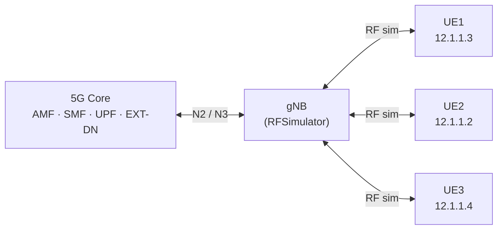

<div align="center">

# 📡 OAI 5G SA Multi-UE with RFSimulator

**A validated, step-by-step workflow for deploying a 3-UE 5G Standalone network using OpenAirInterface and RFSimulator on Docker.**


</div>

---

## 📖 Overview

This repository documents the complete **execution, verification, and interpretation** workflow for a multi-UE 5G SA setup built with [OpenAirInterface (OAI)](https://gitlab.eurecom.fr/oai/openairinterface5g) and its RF simulator. No physical radio hardware is required.

It focuses purely on **running and validating** the system. Installation of the prerequisites is out of scope.

### ✨ What you will achieve

- 🧠 Start the 5G Core (MySQL, AMF, SMF, UPF, EXT-DN)
- 📶 Launch the gNB with RF simulation
- 📱 Connect **three UEs** simultaneously
- 🌐 Verify PDU session IP allocation
- 🏓 Test ping connectivity between all UE pairs
- 🚀 Measure concurrent throughput with `iperf3`

---

## 🏗️ Architecture



### 🌍 UE addressing

| UE  | Container             | IP        |
|-----|-----------------------|-----------|
| UE1 | `rfsim5g-oai-nr-ue`   | 12.1.1.3  |
| UE2 | `rfsim5g-oai-nr-ue2`  | 12.1.1.2  |
| UE3 | `rfsim5g-oai-nr-ue3`  | 12.1.1.4  |

### 🐳 Containers

| Container              | Role   | IP             |
|------------------------|--------|----------------|
| `rfsim5g-mysql`        | MySQL  | —              |
| `rfsim5g-oai-amf`      | AMF    | 192.168.70.132 |
| `rfsim5g-oai-smf`      | SMF    | 192.168.70.133 |
| `rfsim5g-oai-upf`      | UPF    | 192.168.70.134 |
| `rfsim5g-oai-ext-dn`   | EXT-DN | 192.168.70.135 |
| `rfsim5g-oai-gnb`      | gNB    | —              |
| `rfsim5g-oai-nr-ue`    | UE1    | 12.1.1.3       |
| `rfsim5g-oai-nr-ue2`   | UE2    | 12.1.1.2       |
| `rfsim5g-oai-nr-ue3`   | UE3    | 12.1.1.4       |

---

## 🧰 Prerequisites

- 🐧 Ubuntu 24.04 LTS
- 🐳 Docker and Docker Compose (tested with Docker `29.1.3`, Compose `v5.4.0`)
- 📦 OAI repository cloned and Docker images available

---

## 🚀 Quick Start

```bash
cd ~/openairinterface5g/ci-scripts/yaml_files/5g_rfsimulator

# 1) Core network
docker compose up -d mysql oai-amf oai-smf oai-upf oai-ext-dn
sleep 10

# 2) gNB
docker compose up -d oai-gnb
sleep 5

# 3) Three UEs
docker compose up -d oai-nr-ue oai-nr-ue2 oai-nr-ue3

# 4) Check everything
docker compose ps
```

> 🔁 The same sequence is available as a script: [`scripts/start_all.sh`](scripts/start_all.sh)

---

## 🪜 Step-by-Step Workflow

<details>
<summary><b>1️⃣ Verify Docker</b></summary>

```bash
docker --version
docker compose version
```
Expected: Docker `29.1.3`, Compose `v5.4.0`. A reboot does not remove images or configs.
</details>

<details>
<summary><b>2️⃣ Start the 5G Core</b></summary>

```bash
docker compose up -d mysql oai-amf oai-smf oai-upf oai-ext-dn
docker compose ps
```
All five services should report `Up (healthy)`.
</details>

<details>
<summary><b>3️⃣ Start the gNB</b></summary>

```bash
docker compose up -d oai-gnb
```
</details>

<details>
<summary><b>4️⃣ Launch the three UEs</b></summary>

```bash
docker compose up -d oai-nr-ue oai-nr-ue2 oai-nr-ue3
docker compose ps
```
All 9 containers should be running.
</details>

---

## ✅ Validation Results

### 📶 Radio status

```bash
docker compose logs --tail=15 oai-nr-ue
```

| UE  | RNTI | SINR (dB) | RSRP (dBm) | HARQ errors |
|-----|------|-----------|------------|-------------|
| UE1 | f537 | 44.1      | -41        | 0           |
| UE2 | 8969 | 45.1      | -41        | 0           |
| UE3 | 1626 | 46.3      | -41        | 0           |

All UEs reached `NR_RRC_CONNECTED`. These values reflect the idealized RFSimulator channel.

### 🌐 PDU sessions

```bash
docker exec -it rfsim5g-oai-nr-ue  ip a show oaitun_ue1
docker exec -it rfsim5g-oai-nr-ue2 ip a show oaitun_ue1
docker exec -it rfsim5g-oai-nr-ue3 ip a show oaitun_ue1
```

| UE  | IP          |
|-----|-------------|
| UE1 | 12.1.1.3/24 |
| UE2 | 12.1.1.2/24 |
| UE3 | 12.1.1.4/24 |

### 🏓 Ping (all 6 directions, 3 packets each)

```bash
docker exec -it rfsim5g-oai-nr-ue  ping -c 3 12.1.1.2
docker exec -it rfsim5g-oai-nr-ue3 ping -c 3 12.1.1.3
```

| Source | Destination | Loss |
|--------|-------------|------|
| UE1 | UE2 | 0% |
| UE1 | UE3 | 0% |
| UE2 | UE1 | 0% |
| UE2 | UE3 | 0% |
| UE3 | UE1 | 0% |
| UE3 | UE2 | 0% |

### 🚀 Throughput (iperf3, 20 s, 2 parallel streams)

```bash
# Server on UE2
docker exec -it rfsim5g-oai-nr-ue2 iperf3 -s

# Clients
docker exec -it rfsim5g-oai-nr-ue  iperf3 -c 12.1.1.2 -t 20 -P 2
docker exec -it rfsim5g-oai-nr-ue3 iperf3 -c 12.1.1.2 -t 20 -P 2
```

| Client → Server | Sender (Mbit/s) | Receiver (Mbit/s) |
|-----------------|-----------------|-------------------|
| UE1 → UE2       | 33.6            | 31.3              |
| UE3 → UE2       | 35.0            | 32.0              |

### 📋 Summary

| Item | Status |
|------|--------|
| Core NFs | ✅ Healthy |
| gNB + RFSim | ✅ Running |
| UE sync | ✅ All 3 connected |
| RRC state | ✅ CONNECTED |
| PDU sessions | ✅ IPs assigned |
| Ping (all pairs) | ✅ 0% loss |
| Throughput | ✅ ~31–32 Mbit/s per UE |

---

## 🛠️ Troubleshooting

| Issue | Solution |
|-------|----------|
| `iperf3: server busy` | Wait for the running test, restart the server, or use a different port (`-p`) |
| `Service not found (ue1)` | Use `oai-nr-ue`, not `ue1` |
| Container unhealthy | Wait ~10 s, then check `docker compose logs <service>` |
| Ping fails | Verify all containers are up with `docker compose ps` |
| Core won't start | Check the Docker daemon: `sudo systemctl status docker` |

### 🔁 Restart after reboot

```bash
./scripts/start_all.sh
```

---

## 🧪 Helper Scripts

All scripts live in [`scripts/`](scripts/). Make them executable once with `chmod +x scripts/*.sh`.

| Script | What it does | Usage |
|--------|--------------|-------|
| 🚀 `start_all.sh` | Starts core → gNB → 3 UEs in the right order | `./scripts/start_all.sh` |
| 🛑 `stop_all.sh` | Stops UEs → gNB → core in reverse order | `./scripts/stop_all.sh` |
| 🌐 `check_ips.sh` | Prints the PDU-session IP of each UE (`oaitun_ue1`) | `./scripts/check_ips.sh` |
| 🏓 `ping_all.sh` | Pings all 6 UE pairs, prints ✅/❌ per pair (exit code 1 on any failure) | `./scripts/ping_all.sh [count]` |
| 🚀 `iperf_test.sh` | Runs UE1→UE2 and UE3→UE2 simultaneously on separate ports | `./scripts/iperf_test.sh [seconds] [streams]` |

Typical validation run:

```bash
./scripts/start_all.sh
./scripts/check_ips.sh
./scripts/ping_all.sh
./scripts/iperf_test.sh 20 2
```

---

## ⚠️ Notes & Limitations

- This is a **simulation-based** setup (RFSimulator). Results such as SINR/RSRP and throughput do not represent real over-the-air performance.
- A single `iperf3` server normally serves one test at a time. For strictly simultaneous tests, start two server instances on different ports (e.g. `-p 5201` and `-p 5202`).
- Throughput depends on host CPU, since the PHY runs in software.

---

## 🗂️ Repository Structure

```text
.
├── README.md
├── LICENSE
├── scripts/
│   ├── start_all.sh
│   ├── stop_all.sh
│   ├── check_ips.sh
│   ├── ping_all.sh
│   └── iperf_test.sh
├── docs/
│   ├── OAI_Multi-UE_Execution_Guide.pdf
│   └── images/
├── logs/
│   └── sample-outputs.md
└── docker-compose/        # your modified compose file(s), if any
```

---

## 🗺️ Roadmap

- [ ] 📊 Add more UEs (scale beyond 3)
- [ ] 🔬 Add a monitoring / KPI collection script
- [ ] 🧩 Integrate with O-RAN components (e.g. near-RT RIC / xApps)
- [ ] 🧪 Automate validation with a single test script

---

## 📚 References

- [OpenAirInterface 5G](https://gitlab.eurecom.fr/oai/openairinterface5g)
- [OAI Documentation](https://gitlab.eurecom.fr/oai/openairinterface5g/-/tree/develop/doc)
- [OAI CN5G](https://gitlab.eurecom.fr/oai/cn5g)

---

## 👤 Author

**Matin Shirani Zadeh**
Summer 2026 · Internal documentation, O-RAN Project

---

